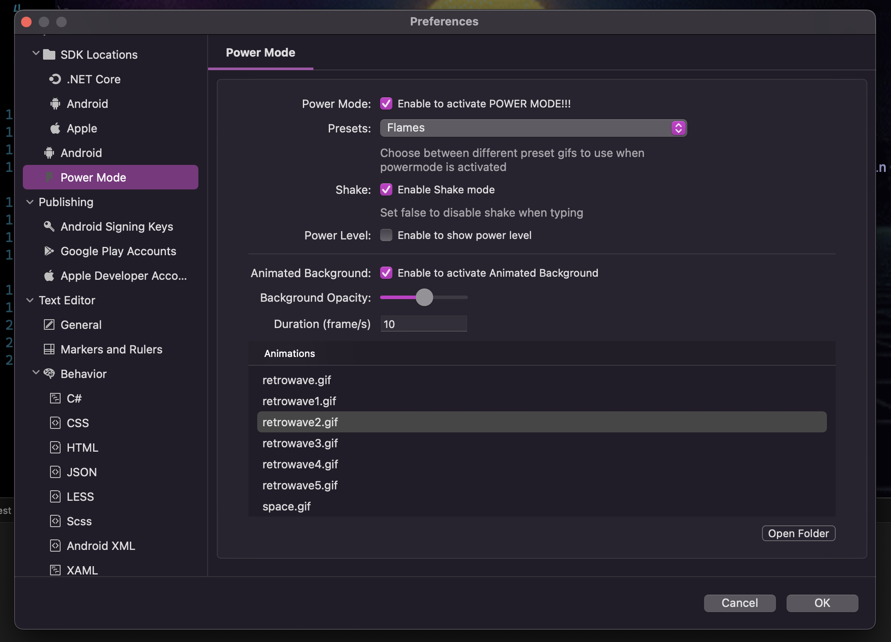

# POWER MODE for VSMac!!!

**YOUR CODE MORE STRONGER THAN EVER!!**

Customize you VSforMac to the next level with beautiful animations, keycombo counters and dynamic animated backgrounds.. all combined with **Shake** movements while typing to make more awesome the coding experience.

## Features:
* Amazing background animations for SourceEditor
* Powerful Combo Meter!
* Easily choose from a variety of [built-in effects](#choose-your-explosions) including explosions, interdeminsional portals, and clippy. Or quickly edd your own!
* Beatiful settings

## Get started

* Enable in the settngs UI
* Enjoy the default experience, or choose from a set of built-in effects
* Find more effects or share your own on [here](https://github.com/netonjm/PowerMode/issues/1).

## Choose Your Explosions:

### Particles (Default)

### Rift (Simple)

### Rift (Exploding)

### Fireworks

### Flames

### Magic

### Clippy

## Help Wanted:
If you can provide some lightweight, attractive gifs that improve how power mode looks and performs, I would be happy to include them! Share them [here](https://github.com/netonjm/PowerMode/issues/1).

## Acknowledgements:
* Thanks to [@hoovercj](https://github.com/hoovercj) for create this awesome extension in VSCode
* Thanks to [@ao-shen](https://github.com/ao-shen) for insight into animating size and colors for the combo-meter
* Thanks to [@RPuffer](https://github.com/RPuffer) for providing the incredible gifs added in version 2.1
* Thanks to [@darkvertex](https://github.com/darkvertex) for providing the awesome gifs added in version 2.0
* Thanks to [@horvay](https://github.com/horvay) for giving me ideas to get around the limitations I had in v0.0.1

